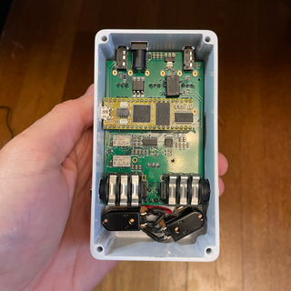
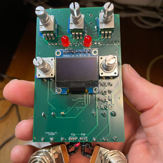
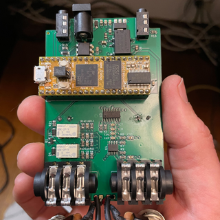
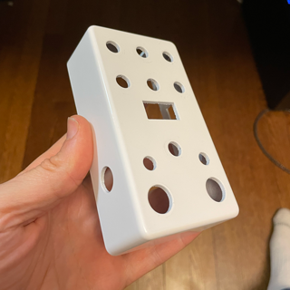
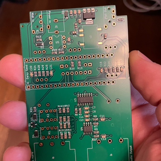

# Guitar Pedal 125b

### Rev 3 - 4/14/2023

Updates include:
1. Swapped the placement of the Footswitches and LEDs on the PCB to be consistent with my other pedals.

### Rev 2 - 3/29/2023

Updates include:
1. Added 3 Additional Pots (Total of 6)
2. Improved OLED Screen Placement
3. Removed an Encoder (now just 1)
4. Tayda Custom Drill Template for easily ordering a pre-drilled enclosure

### Overview

A project to create a digital effect pedal based on the Electro-Smith Daisy Seed that fits into a standard 125B sized Guitar Pedal enclosure.

This project is still work in progress and is an evolution of my [1590B sized Pedal](https://github.com/bkshepherd/DaisySeedProjects/tree/main/GuitarPedal1590b). Documenation is sparse at the moment, but I hope to improve it over time.

 
 
 

### Features

1. 125B size pedal board friendly enclosure!
2. Buffered Stereo Input and Outputs for Guitar Level signals
2. Relay based "True Bypass" switching
3. TRS Mini MIDI Input and Outputs
4. OLED Display
5. Rotary Encoder for Display Navigation
6. 6 Pots
7. Up to 2 Footswitches
8. Up to 2 Leds
9. Standard 9v center pin negative power jack
10. Easy access to the Daisy Seed USB port and reset buttons for updating the firmware
11. Primarily SMD parts for easy assembly by your PCB provider
12. Easily order a custom drilled enclosure from Tayda! [Template Here](https://drill.taydakits.com/box-designs/new?public_key=ZXRnaU9PaWx0b1hNa3VxeTJua3d2dz09Cg==)

This project includes a KiCad project with the necessary schematics and PCB layout files to create everything you need to build the hardware. I actually used JLCPCB to manufacture the PCB and assemble the SMD parts and most of the through-hole parts.  The BOM file is in the proper format for them to assemble it with their available parts.  Sample Code is also provided with a hardware attraction layer as well as a custom Tremolo effect that uses the hardware.

Information about the Daisy Seed can be found at:

http://electro-smith.com

Information about KiCad can be found at:

https://www.kicad.org
