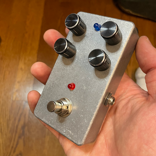
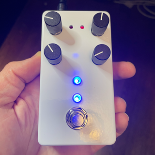
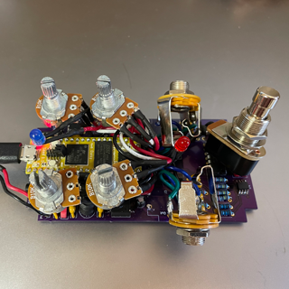
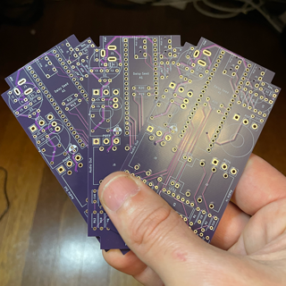

# Guitar Pedal 1590b

### Rev 5 - 6/3/2023

Updates include:
1. Updated PCB to properly ground input / output jacks when no plug is inserted
2. Fixed a software issue causing noise from the LED.
3. Included exported Gerber files to make it easy to order PCBs from JCLPCB. Detailed instructions can be found on the [Build the Hardware](docs/README.md) page. This requires no knowledge of KiCad to get the PCBs made.

### Overview

A project to create a digital effect pedal based on the Electro-Smith Daisy Seed that fits into a standard 1590B sized Guitar Pedal enclosure. Electro-Smith sells a guitar pedal, but it's a much larger format, and I wanted something as small as possible.  The PedalPCB Terrarium was another option, but it's mono only, so I decided to build my own. This one is a smaller form factor than both, operates in Mono or Stereo, and has Midi support, so it's capable little pedal platform.

 

 

### Features

1. Small 1590B pedal board friendly enclosure!
2. Buffered Stereo Input and Outputs for Guitar Level signals
3. TRS Mini MIDI Input and Outputs
4. 4 Pots
5. Up to 2 Footswitches
6. Up to 2 Leds
7. Standard 9v center pin negative power jack
8. Easily Assembled from easily sourced through-hole parts, no SMD soldering required!
9. Easily order a custom drilled enclosure from Tayda!

This project includes a KiCad project with the necessary schematics and PCB layout files to create everything you need to build the hardware and code the provides a hardware attraction layer as well as sample code with a custom Tremolo effect that uses the hardware.

Click on this image for a Demo Video (of an older revision):

Information about the Daisy Seed can be found at:

http://electro-smith.com

Information about KiCad can be found at:

https://www.kicad.org

Getting Started:

1. [Build the Hardware](docs/README.md)
2. [Deploy the Software to the Hardware](src/README.md)

## Past Revisions
### Rev 4 - 4/12/2023

Updates include:
1. Updated PCB layout to move some components farther away from the edges
2. Swapped the placement of Footswitches and LEDs for consistency with my other projects 
3. Updated code to make Footswitch 1 & Led 1 enable / disabe the effect

### Rev 3 - 3/29/2023

Updates include:
1. Improved 4 Layer PCB Layout, much easier to assemble!
2. Replaced all SMD parts with through-hole alternative
3. Tayda Custom Drill Template for easily ordering a pre-drilled enclosure
