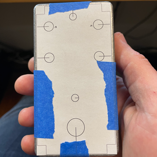

# Building the Hardware
Some quick instructions for how to make the GuitarPedal1590B Hardware.  This document assumes you know the basics about soldering and circuit board assembly.  You'll also need to be fairly handy with a drill to mount the various knobs and switches on the enclosure.

Also, I just want to achnowledge that the schematics for the circuits were kit bashed together from the following sources with some additions of my own:

* [Electro-Smith: Daisy Petal Rev 5 Schematics](https://github.com/electro-smith/Hardware/blob/master/reference/daisy_petal/ES_Daisy_Petal_Rev5.pdf)
* [Simple DIY Electronic Music Projects](https://diyelectromusic.wordpress.com/2022/08/29/3v3-midi-module-pcb/)

Getting everything into KiCad and the PCB layouts are all my own work.

## 1. Order the PCBs

The KiCad files are included for the full schematic and pcb board layout in the **pcb** folder.  You really don't need to know anything about KiCad to order the PCB and get it made, but they are there for reference.

I like to order my PCBs from https://oshpark.com, but anywhere should work fine.

Visit that website and simply upload the **DaisySeedPedal1590b.kicad_pcb** file. They will show you what it's going to look like and they will give you a price for ordering 3 pcbs (that's their minimum order).  I think I paid ~$40.  It will take a week or two for it arrive and they look like this:

## 2. Source the Components

A full list of all the required components can be found in the [Bill_of_Materials_BOM.xlsx](Bill_of_Materials_BOM.xlsx) file.  Almost everything uses Through-Hole type components, but there are a few SMD components.

You'll also need to order the enclosure.  I used this one from Amazon: https://www.amazon.com/dp/B07VKR51NN

## 3. Solder Everything

The SMD parts are tricky, but there aren't many, and I was able to hand solder them just fine. One tricky thing is to use appropriate lengths of wire for the various knobs and switches so that they will reach the proper locations on the enclosure, so plan ahead!

It will roughly look like this when finished with this step:

(I ommited the 2 toggle switches and the 2nd footswitch from my build)

## 4. Flash the Software to the Hardware

Before you attempt to get everything fitted into the enclosure, it's best to make sure all the hardware works.

You'll need to compile the code and flash it into the Daisy Seed on the hardware. Instructions can be found [here](../README.md).

## 5. Drill Holes in the Enclosure

I used an electric drill by hand with some step drill bits, which worked great. It's a bit hard to get everything lined up, so measure carefully. I made a quick template, printed, and taped it before I drilled my holes:

## 6. Jam everything into the enclosure, and ENJOY!

