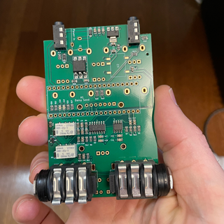
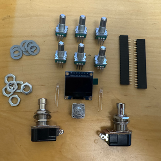
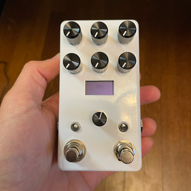

# Ordering Hardware from me
I get a lot of requests to buy kits or finished pedals based on my designs. This is not something I typically do, but sometimes I do have extra PCBs, parts, and enclosures lying around and I'm willing to pass them along to you, basically at cost, as outlined in the options below.

If you are interested, please message me through GitHub or you can find me on the Electro-Smith [Forums](https://forum.electro-smith.com/t/my-daisy-guitar-pedal-designs-on-github/3641) & [Discord](https://discord.gg/ByHBnMtQTR) as Kshep and can message me there. 

I also really can't supply much customer support on this stuff or offer any warranty on the hardware. I'm not really trying to start a pedal business. I'm doing this for fun and to learn new things, which is why I provide all these designs and documenation here on GitHub for free.

## Option 1 - PCB Only
Price: $50 (USD) + Shipping & Handling

About as bare bones as you can get. 

This option is just the PCB with all the SMD components soldered on.  You will still need to source the additional parts, solder the additional parts to the PCB, get an Enclosure, get Knobs and other hardware for the Enclosure, get a Daisy Seed, and Assemble everything yourself.

You'll basically be starting at [Step 5: Build the Hardware](README.md#5-order-the-additional-parts-jlcpcb-doesnt-assemble)

## Option 2 - PCB + the Additional Parts to Complete the PCB
Price: $75 (USD) + Shipping & Handling

Sometimes I have the extra parts necessary to complete the PCB lying around.

This option is a step up from Option 1. At least you won't have to order all the additional parts from everywhere! You will still need to solder the additional parts to the PCB, get an Enclosure, get Knobs and other hardware for the Enclosure, get a Daisy Seed, and Assemble everything yourself.

You'll basically be starting at [Step 6: Finish the PCB](README.md#6-finish-the-pcb-solder-everything)

## Option 3 - Complete PCB (without Daisy Seed)
Price: $100 (USD) + Shipping & Handling

Not feeling like you want to solder anything? I hear ya, me either.

This option gets you a fully assembled PCB, I'll even test it (briefly) to make sure it works. You will still need to get an Enclosure, get Knobs and other hardware for the Enclosure, get a Daisy Seed, and Assemble everything yourself.

You'll basically be starting at [Step 7: Order the Enclosure and External Hardware](README.md#7-order-the-enclosure-and-external-hardware)

## Option 4 - Complete Pedal (without Daisy Seed)
Price: $150 (USD) + Shipping & Handling

Honestly, I don't love this option, but I might be willing to go the extra mile, depending if I'm really feeling generous with my time. Like I said at the beginning, I'm not really interested in getting into the pedal business.

I also usually don't have extra Enclosures and Knobs around, so this might not always be an option. Plus picking a custom color and knobs for your pedal is half the fun! [Step 7: Order the Enclosure and External Hardware](README.md#7-order-the-enclosure-and-external-hardware) is so freaking easy, I highly recommend doing Option 3, instead of this one.

This option is everything you need, except the Daisy Seed. Knobs and Enclosure colors are at my whim and may vary based on what I have lying around.

You'll basically get a finished pedal ready for you to [create your own cool effects](../../../Software/GuitarPedal/README.md).

