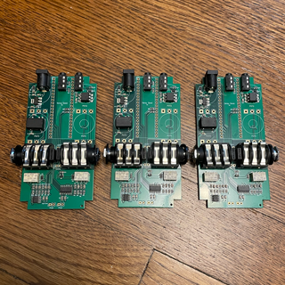

# Guitar Pedal 1590b using SMD Parts

### Rev 2 - 11/3/2023

Updates include:
1. Updated PCB to include the hardware mute
2. Included exported Gerber files to make it easy to order PCBs from JCLPCB. Detailed instructions can be found on the [Build the Hardware](docs/README.md) page. This requires no knowledge of KiCad to get the PCBs made.

### Overview

A project to create a digital effect pedal based on the Electro-Smith Daisy Seed that fits into a standard 1590B sized Guitar Pedal enclosure. Electro-Smith sells a guitar pedal, but it's a much larger format, and I wanted something as small as possible.  The PedalPCB Terrarium was another option, but it's mono only, so I decided to build my own. This one is a smaller form factor than both, operates in Mono or Stereo, and has Midi support, so it's capable little pedal platform.

This project is the SMD parts version of my 1590b pedal. Features are the same as the Through-Hole version with the addition of "True Bypass". The majority of all parts can be pre-assembled on the PCB by a fab like JLCPCB. If you'd prefer a design where all parts are through-hole components, please check out the through-hole version of this project [Guitar Pedal 1590 project](../GuitarPedal1590b/README.md).

 

 

### Features

1. Small 1590B pedal board friendly enclosure!
2. Buffered Stereo Input and Outputs for Guitar Level signals
3. TRS Mini MIDI Input and Outputs
4. 4 Pots
5. Up to 2 Foot Switches
6. Up to 2 Leds
7. Standard 9v center pin negative power jack
8. Setup for Easy Manufacturing with JLCPCB.  Minimal soldering required!
9. Easily order a custom drilled enclosure from Tayda!

This project includes a KiCad project with the necessary schematics and PCB layout files to create everything you need to build the hardware.

Click on this image for a Demo Video (this pedal is on the left in the pedal board):

Getting Started:

1. [Build the Hardware](docs/README.md)
2. [Deploy the Software to the Hardware](../../Software/GuitarPedal/README.md)
