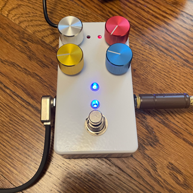

# Guitar Pedal 1590b - Through-Hole Parts

### Rev 6 - 11/12/2023

Updates include:
1. Updated the PCB to have an optional bypass of the PDS1 5v Isolation circuit.

### Overview

A project to create a digital effect pedal based on the Electro-Smith Daisy Seed that fits into a standard 1590B sized Guitar Pedal enclosure. Electro-Smith sells a guitar pedal, but it's a much larger format, and I wanted something as small as possible.  The PedalPCB Terrarium was another option, but it's mono only, so I decided to build my own. This one is a smaller form factor than both, operates in Mono or Stereo, and has Midi support, so it's capable little pedal platform.

The video below shows a pedal board I made using this design, the smaller pedal on the far left, along with 2 of my [125B sized pedals](../GuitarPedal125b/README.md).

This project is the Through-Hole parts version of my 1590b pedal. All parts are through-hole components and can easily be hand soldered. There is also a version of this same pedal where all parts are SMD parts that can be assembled by a fab such as JLCPCB, if you are looking for that, please check out my [Guitar Pedal 1590b-SMD project](../GuitarPedal1590b-SMD/README.md).

 

 

### Features

1. Small 1590B pedal board friendly enclosure!
2. Buffered Stereo Input and Outputs for Guitar Level signals
3. TRS Mini MIDI Input and Outputs
4. 4 Pots
5. Up to 2 Foot Switches
6. Up to 2 Leds
7. Standard 9v center pin negative power jack
8. Easily Assembled from easily sourced through-hole parts, no SMD soldering required!
9. Easily order a custom drilled enclosure from Tayda!

This project includes a KiCad project with the necessary schematics and PCB layout files to create everything you need to build the hardware. The included exported Gerber and Assembly files make it easy to order PCBs from JCLPCB. Detailed instructions can be found on the [Build the Hardware](docs/README.md) page. This requires no knowledge of KiCad to get the PCBs made.

Once you've built the hardware you can deploy the software from my Multi-Effect Guitar Pedal software project by following these directions: [Deploy the Software to the Hardware](../../Software/GuitarPedal/README.md)

This software provides a hardware abstraction layer as well as a few custom FX including Tremolo, Chorus, Overdrive, and Stereo Auto-Pan.

Click on this image for a Demo Video (this pedal is on the left in the pedal board):

Getting Started:

1. [Build the Hardware](docs/README.md)
2. [Deploy the Software to the Hardware](../../Software/GuitarPedal/README.md)

## Past Revisions
### Rev 5 - 6/3/2023

Updates include:
1. Updated PCB to properly ground input / output jacks when no plug is inserted
2. Fixed a software issue causing noise from the LED.
3. Included exported Gerber files to make it easy to order PCBs from JCLPCB. Detailed instructions can be found on the [Build the Hardware](docs/README.md) page. This requires no knowledge of KiCad to get the PCBs made.
   
### Rev 4 - 4/12/2023

Updates include:
1. Updated PCB layout to move some components farther away from the edges
2. Swapped the placement of Footswitches and LEDs for consistency with my other projects 
3. Updated code to make Footswitch 1 & Led 1 enable / disabe the effect

### Rev 3 - 3/29/2023

Updates include:
1. Improved 4 Layer PCB Layout, much easier to assemble!
2. Replaced all SMD parts with through-hole alternative
3. Tayda Custom Drill Template for easily ordering a pre-drilled enclosure

More Information about the Daisy Seed can be found at:

http://electro-smith.com

More Information about KiCad can be found at:

https://www.kicad.org
