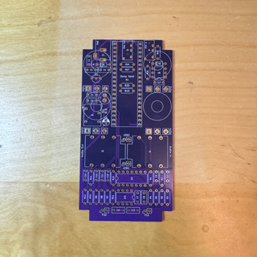

# Ordering Hardware
I get a lot of requests to buy kits or finished pedals based on my designs. This is not something I typically do, but sometimes I do have extra PCBs, parts, and enclosures lying around and I'm willing to pass them along to you, basically at cost, as outlined in the options below.

If you are interested, please message me through GitHub or you can find me on the Electro-Smith [Forums](https://forum.electro-smith.com/t/my-daisy-guitar-pedal-designs-on-github/3641) & [Discord](https://discord.gg/ByHBnMtQTR) as Kshep and can message me there. 

I also really can't supply much customer support on this stuff or offer any warranty on the hardware. I'm not really trying to start a pedal business. I'm doing this for fun and to learn new things, which is why I provide all these designs and documentation here on GitHub for free.

## Option 1 - PCB Only
Price: $10 (USD) + Shipping & Handling

About as bare bones as you can get. 

This option is just the PCB.  You will still need to source the components, solder everything to the PCB, get an Enclosure, get Knobs and other hardware for the Enclosure, get a Daisy Seed, and Assemble everything yourself.

You'll basically be starting at [Step 5: Build the Hardware](README.md#2-source-the-components)

