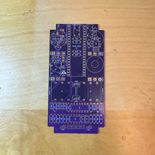

# Building the Hardware
Some quick instructions for how to make the GuitarPedal1590B Hardware.  This document assumes you know the basics about soldering and circuit board assembly.  You'll also need to be fairly handy with a drill to mount the various knobs and switches on the enclosure (or you can order one pre-made from Tayda).

Quick note, I couldn't include some of the custom footprints for specific components due to licenses that wouldn't allow redistribution.  Here is a list of where you can find some of them:

* PDS1-S5-S5-D - https://www.cui.com/product/dc-dc-converters/isolated/pds1-d-series (click on "all models" for downloadable footprints)
* Neutrik NMJ6HCD2 - https://www.snapeda.com/parts/NMJ6HCD2/Neutrik/view-part/
* PJ-320A - Footprint and STEP Model found on this repository https://github.com/keebio/Keebio-Parts.pretty

Also, I just want to acknowledge that the schematics for the circuits were kit bashed together from the following sources with some additions of my own:

* [Electro-Smith: Daisy Petal Rev 5 Schematics](https://github.com/electro-smith/Hardware/blob/master/reference/daisy_petal/ES_Daisy_Petal_Rev5.pdf)
* [Simple DIY Electronic Music Projects](https://diyelectromusic.wordpress.com/2022/08/29/3v3-midi-module-pcb/)

Getting everything into KiCad and the PCB layouts are all my own work.

## 1. Order the PCBs

The KiCad files are included for the full schematic and pcb board layout in the **pcb** folder.  You really don't need to know anything about KiCad to order the PCB and get it made, but they are there for reference.

I like to order my PCBs from https://www.jlcpcb.com, but anywhere should work fine.

Follow these steps to get the PCB made by JLCPCB:

1. Download the ready-made [JLCPCB Gerber Files](../pcb/JLCPCB-Gerbers/DaisySeedPedal1590b-Rev6-gerbers.zip) for this project to your computer. (Keep the files zipped)
2. Visit the [JLCPCB Website](https://www.jlcpcb.com).
3. Click the **Order Now** button in the top menu bar.
4. Click the **Add Gerber File** button. 
5. Upload the zipped Gerber files you downloaded above.
6. After processing the files it should provide a screen with various options. Everything is fine by default, but you may want to change the color of the board and I like to use ENIG finishing options instead of HASL, but this is up to you. 
7. Add the item to your cart, and order the PCB.

They will give you a price for ordering 5 pcbs (that's their minimum order).  I think I paid ~$50 for a Purple board with ENIG (this is a more expensive option).  It will take a week or two for it arrive and they look like this:

## 2. Source the Components

A full list of all the required components can be found in the [Bill_of_Materials_BOM.xlsx](Bill_of_Materials_BOM.xlsx) file.  Everything uses Through-Hole type components for simplicity sake.

## 3. Solder Everything

I like to solder in the following order for simplicy:

1. All Resistors
2. Diodes - D1 & D2
3. MLCC Capacitors - 10uF - C1, C4, C9, C10, C11, C12, C15, C16
4. (*Optional) MLCC Capacitor - 10uF - C5
5. Film Capacitors - 100nF - C2, C3, C7, C8, C13, C14
6. Ceramic Capacitor - 100nf - C17
7. LDO - 5V Linear Voltage Regular - U1
8. ICs - U3,U4,U5
9. Jacks - J1, J2, J3, J4, J5
10. 20 Pin Headers (x2) - A1
11. 3mm LEDs - LED1 & LED2 - You'll want to keep the legs long possibly using a 10mm spacer from the PCB, Short pin goes to the square pad!

Optional Filtered Power Supply:

If you plan to connect this pedal to a high quality isolated power source, this step is not necessary. Otherwise, it's probably a good idea to do. You can add it later if you like, but you'll have to remove the Pot that this stuff sits under...

12. (*Optional) Electrolytic Capacitor - 22uF - C6
13. (*Optional) Inductor - 2.2 uH - L1
14. (*Optional) - Isolated Power Converter - U2

If you don't plan to use the Optional parts above, you must bridge the contacts on R21 with solder. Otherwise, leave R21 unbridged.

Finally:

15. All Pots
16. All Footswitches

It goes a little something like this:

(I omitted the 2nd foot switch from my build)

## 4. Flash the Software to the Hardware

Before you attempt to get everything fitted into the enclosure, it's best to make sure all the hardware works.

You'll need to compile the code and flash it into the Daisy Seed on the hardware. Instructions can be found [here](../../../Software/GuitarPedal/README.md).

## 5. Order the Enclosure

You'll also need to order the enclosure, which is 1590B sized.

You can either order a generic one like this from Amazon: https://www.amazon.com/dp/B07VKR51NN and drill your own holes (which is a pain in the butt), or you can order a custom drilled & powder coated enclosure from Tayda using this [Custom Drill Template](https://drill.taydakits.com/box-designs/new?public_key=YWRhVFFGU0Z2c3RJR09VQ1U4S3EvUT09Cg==)

Please note, the top two tiny holes inbetween the knobs are so you can reach the flash and reset buttons on the DaisySeed, for easy re-programming during development.  You can keep or omit them. 

## 6. Jam everything into the enclosure, and ENJOY!

