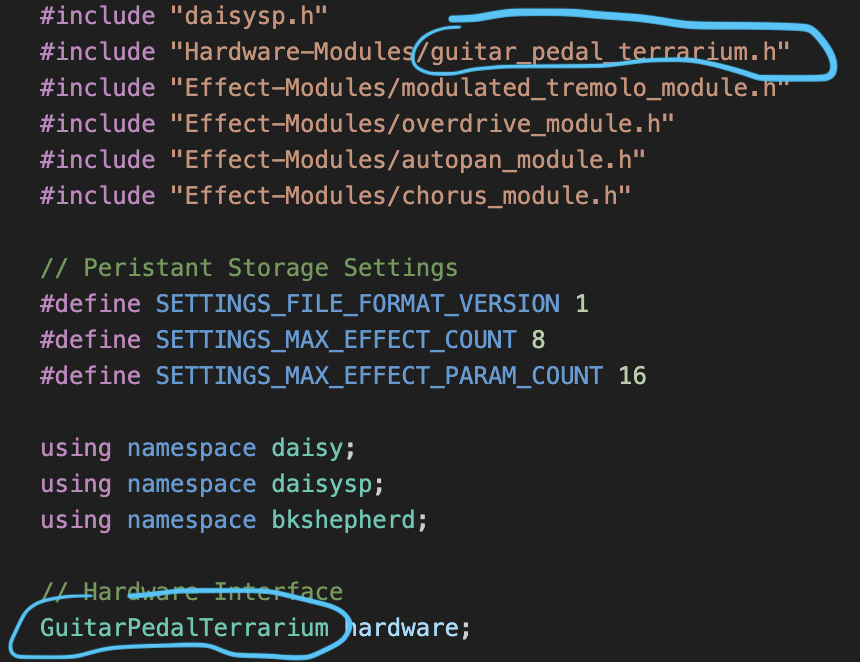

# Multi-Effect Guitar Pedal Software
This directory includes all the source code for my Multi-Effect Guitar Pedal that runs on various hardware platforms. 

## Software Update - 2/12/2024
Big update to the handling of Persistant Storage.  Thank you @jaching!

Updates include:

1. Removed the hard limit the number of parameters stored per EffectModule.
2. Ability to have multiple stored Presets for each EffectModule
3. Reset All Presets button now located in the Preset Menu
4. Changing Midi to call custom callback when a midi cc cannot be found.
5. Added a NEW Multi tap delay Effect Module!
6. The software is now configured to use the Boot Loader by default to allow for more memory usage.

## Getting Started
Before you can use the software you'll need to do the following:

### 1. Setup your Development Environment

The code in this project is supplied with a Microsoft Visual Code project and depends on both **LibDaisy** and **DaisySP** from Electro-Smith. Detailed instructions on setting these up for your dev environment can be found here:

https://electro-smith.github.io/libDaisy/index.html

### 2. Update Paths to your install of LibDaisy and DaisySP

* Note - You shouldn't have to do this step if the project pulled down from GitHub with them already included as sub-modules.  You can check in your /DaisySeedProjects/Software/GuitarPedal/libDaisy and daisySP folders. If they have files in them, you can skip this step.  If they are empty, you can try pulling down the project from GitHub again (the desktop GUI client always should pull down submodules). If it still doesn't pull down and you have libDaisy and DaisySP installed somehwere else, you can follow the steps below: 

You'll need to update the paths in the **Makefile**.
You'll also need to update the paths in the **c_cpp_properties.json** file in the **.vscode/** folder.
You'll also need to update the paths in the **task.json** file in the **.vscode/** folder.

### 3. Configure your specific Target Hardware

You'll need to open the guitar_pedal.cpp file and edit two lines to configure which hardware you are targetting.

If you want to target the GuitarPedal125B hardware change the lines to:

* #include "Hardware-Modules/guitar_pedal_125b.h"
* GuitarPedal125B hardware;

If you want to target the GuitarPedal1590B hardware change the lines to:

* #include "Hardware-Modules/guitar_pedal_1590b.h"
* GuitarPedal1590B hardware;

If you want to target the GuitarPedal1590B-SMD hardware change the lines to:

* #include "Hardware-Modules/guitar_pedal_1590b-SMD.h"
* GuitarPedal1590B-SMD hardware;

If you want to target the Pedal PCB hardware change the lines to:

* #include "Hardware-Modules/guitar_pedal_terrarium.h"
* GuitarPedalTerrarium hardware;

### 4. Build and Deploy the Code

By Default this project is configured to use the custom Boot Loader. To get up and running you'll need to do the following:

1. Put your Daisy Seed into DFU mode.
2. From the terminal, in the GuitarPedal folder run "make program-boot"
3. Once this finishes installing the custom boot loader on the Daisy Seed, press the Reset button. The led will temporary blink for about 3 second.
4. While the LED is blinking run "make program-dfu"
5. That's it!

If you run into trouble with the bootloader.  Electro-Smith has better documentation on how to get it working here: https://github.com/electro-smith/libDaisy/blob/master/doc/md/_a7_Getting-Started-Daisy-Bootloader.md

If you want to use built in flash memory only, you *can*, but it severely limits which effects you can use and how many you can have installed at once. I'd recommend editing the list of active effects in the guitar_pedal.cpp file to perhaps just 1 or 2. Then do the following to get running on internal flash:

1. Remove the "APP_TYPE = BOOT_SRAM" line from the Make File:
2. Put your Daisy Seed into DFU mode.
3. make build-and-program-dfu

### 5. Connect your Guitar and Amp

Plug your guitar into the Input and connect the Output to your amp.

### 6. Enjoy!!!

## Past Updates:

### Software Update - 11/11/2023
Updates include:

1. Refactored the code to move Display UI handling and Persistent Storage out of the main class file.
2. Added functionality to make it easy for an Effect Module to provide custom UI for the Display while the Effect is Active.
   
### Software Update - 10/9/2023
Updates Include:

1. Added support for multiple effects.  Included are a simple tremolo, chorus, overdrive, and stereo auto-panning effects.
2. Created a Hardware Abstraction Layer allowing this software to run on different Daisy seed based hardware targets including my custom hardware as well as the Pedal PCB Terrarium.
3. Updated the menu system to support multiple effects each with their own settings and global hardware settings. Parameters can be updated directly through the menu UI or using the pots on the device.
4. All settings / parameters are now saved to the device memory and restored when the device powers up.
5. Added Midi support to make it simply to map effect parameters to Midi CC commands for controlling presets via midi.
